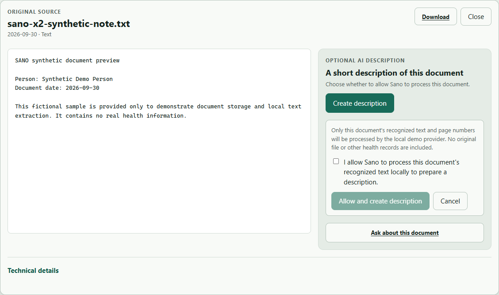

# SANO

Private, source-grounded personal and family health workspace with auditable AI.

[](https://github.com/KirillNedoboy/SANO/actions/workflows/ci.yml) [](LICENSE) [Live demo](https://sanobot.art)

SANO is for people who keep track of their health and parents who manage care for a family. When appointments involve different doctors, documents and past results can be hard to keep together. SANO keeps each person's health history in one place, so you can find an earlier result and prepare for the next visit.

**Live product:** [sanobot.art](https://sanobot.art) · **Repository:** [SANO](https://github.com/KirillNedoboy/SANO)

[Try the live demo](https://sanobot.art) · [Judge guide](docs/judge-guide.md) · [Run locally with Docker](#run-sano-locally) · [Security & trust](docs/architecture/sentient-g5-ecosystem-validation.md) · [Validation](docs/sano-live-validation.md)



*Fictional sample. Provider actions require explicit consent. The screenshot does not represent a live inference result.*

SANO is the product and GitHub repository name. `open-care-proof-kit` is the stable Python package identifier, while `opencare-*` identifiers remain stable for protocols and schemas.

## Why SANO

```text
user-owned source → provenance → Person scope → human review
                  → canonical health context → bounded AI
                  → validated output → Execution Receipt
```

- Preserve original document bytes and source provenance.
- Support PDF, TXT, JPG, and PNG with local Tesseract OCR for Russian and English.
- Keep model context limited to selected, authorized evidence; external disclosure is optional and requires per-action consent.
- Validate provider output and produce an execution receipt. AI cannot change canonical health records.
- Support explicit, revocable Person-scoped family access.

Document summaries and Q&A are separate from medical record creation. A person reviews source-backed candidate facts before they can become canonical records.

## Run SANO locally

Requires Docker with Compose. This quickstart is for local inspection, not internet-facing production.

```powershell
Copy-Item .env.example .env
docker compose up --build
```

Open [http://127.0.0.1:8000/bootstrap](http://127.0.0.1:8000/bootstrap) to create the first local account. The deterministic assistant works without a provider key. To use an external provider, an operator must configure it and the user must consent to each action. See [local deployment](docs/deployment.md) and [production deployment](docs/production_deployment.md).

## Privacy and safety

SANO stores Product Core data in the self-hosted installation. The user selects the Person and evidence available to an action. When an external model is configured, only the minimized selected context may be disclosed after explicit per-action consent; the execution receipt records the outcome. A fully local inference path is supported. Raw genome data never enters the supported provider context.

Repository fixtures, screenshots, and reviewer examples are synthetic or de-identified. Deployment security and backup practices depend on the operator. SANO is not clinically validated software, an AI doctor, diagnostic authority, treatment planner, medication or dosage authority, or clinical decision-support system. This is not a claim of public SaaS readiness.

## Validation and limits

- Public `main` includes Product Core schema v13, SANO-X2 document understanding, PDF/TXT/JPG/PNG, local OCR, and document summary/Q&A.
- Local inference without an external API and the OpenRouter/DeepSeek live provider flow, including document summary/Q&A, are operator-confirmed; see [SANO live validation](docs/sano-live-validation.md). OpenAI live X2 is unverified.
- The exact CI and local validation results, dated baselines, and known limits are recorded in [SANO live validation](docs/sano-live-validation.md).
- SANO v0.3.0 is the published stable release dated 8 October 2026; see the [release notes](docs/releases/v0.3.0.md).
- G5 status remains exactly `READY_FOR_SECOND_CLIENT_SMOKE`; AlphaGenome is paused after C.1.

## AI / LLM validation

SANO uses a provider-independent guarded runtime. Authorization, disclosure,
consent, structured validation, source/page attribution, and execution receipts
remain part of the path for every provider. The statuses below distinguish
deterministic checks from operator-confirmed live provider evidence; GitHub CI
does not execute paid OpenRouter calls.

| Path | Status |
| --- | --- |
| Deterministic local/offline provider path | PASS |
| Provider-independent contract/conformance tests | PASS |
| Safety/output validation | PASS |
| Consent/disclosure flow | PASS |
| Execution Receipt validation | PASS |
| OpenRouter live connectivity | LIVE PASS / operator-confirmed |
| OpenRouter exact model binding | LIVE PASS / operator-confirmed |
| DeepSeek strict structured output | LIVE PASS / operator-confirmed |
| SANO document summary through OpenRouter/DeepSeek | LIVE PASS / operator-confirmed |
| SANO document Q&A through OpenRouter/DeepSeek | LIVE PASS / operator-confirmed |
| Summary page attribution | PASS / operator-confirmed |
| Q&A citations | PASS / operator-confirmed |
| OpenAI provider adapter | TESTED |
| OpenAI live X2 | UNVERIFIED |
| Clinical/model correctness | NOT CLAIMED |

## Engineering evidence

Python 3.12, FastAPI, Docker Compose, SQLite Product Core, local Tesseract
OCR (`rus+eng`), provider-independent agent runtime, OpenRouter/DeepSeek live
validation, portable Trust Envelope, deterministic evals, GitHub Actions, and
backup/recovery are documented in the [reviewer index](docs/final_reviewer_pack.md).

Read the [architecture](docs/architecture.md), [security and threat
model](docs/privacy_safety_threat_model.md), [provenance semantics](docs/provenance_semantics.md),
[Family Access authorization matrix](docs/security/family-access-authorization-matrix.md),
[Trust Envelope protocol](docs/protocol/opencare-trust-envelope.md), [agent trust
integration guide](docs/integrations/agent-trust-integration-guide.md), [deployment
guide](docs/deployment.md), [judge guide](docs/judge-guide.md), and [live
validation](docs/sano-live-validation.md).

For product behavior, see the [judge guide](docs/judge-guide.md), [capability matrix](docs/capability-matrix.md), [privacy and safety threat model](docs/privacy_safety_threat_model.md), and [security reporting](SECURITY.md). For release history, see the [changelog](CHANGELOG.md), [v0.3.0 release notes](docs/releases/v0.3.0.md), and [v0.1.0 private-alpha notes](docs/releases/v0.1.0-private-alpha.md). Read the [private-alpha operator checklist](docs/private-alpha-operator-checklist.md) before running a local instance.
